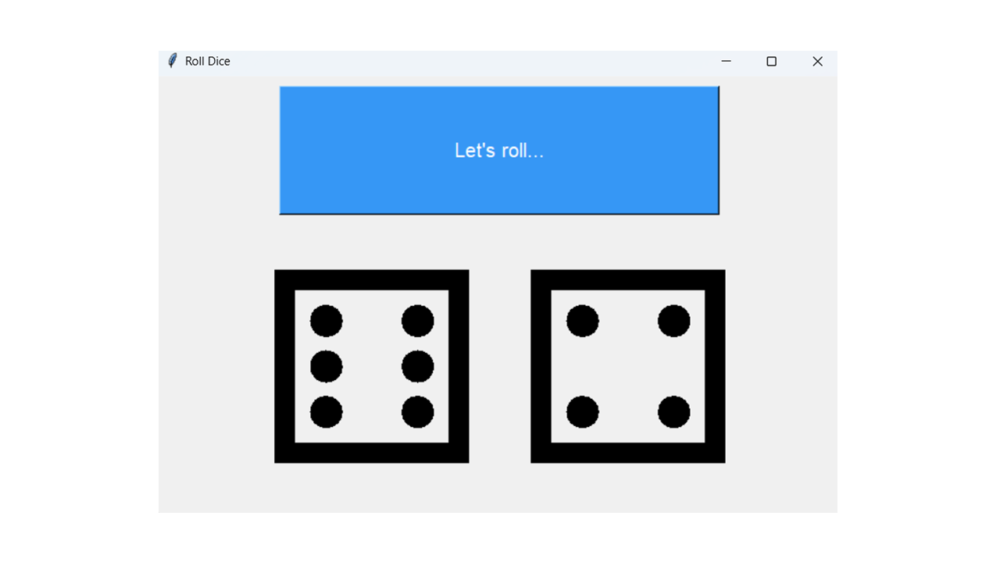

# dice-roller-simulator
A simple Python script to simulate rolling two dice together. Great for beginners learning about random number generation, loops, and basic Python functions.


# 🎲 GUI Dice Roller Simulator (Python + Tkinter)

A simple and fun graphical dice rolling app built with Python's `tkinter`. Clicking the button rolls **two dice** and shows their faces using Unicode characters.

## 🖥️ Preview

  
*(Add a screenshot named `preview.png` to your repo to show what the app looks like)*

## 📦 Features

- GUI-based dice rolling using `tkinter`
- Visual dice using Unicode characters 🎲
- Random results every time
- Beginner-friendly and self-contained script

## 🛠 Requirements

- Python 3.x  
- Tkinter (comes pre-installed with most Python distributions)

## 🚀 How to Run

1. Clone the repository:

```bash
git clone https://github.com/your-username/dice-roller-simulator.git
cd dice-roller-simulator
